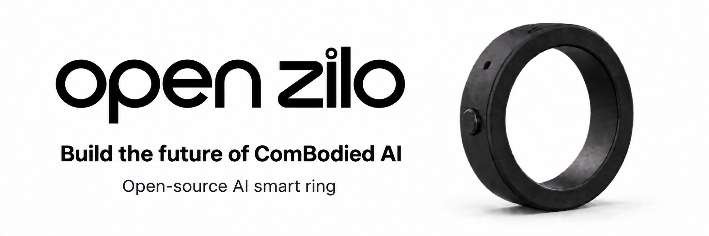
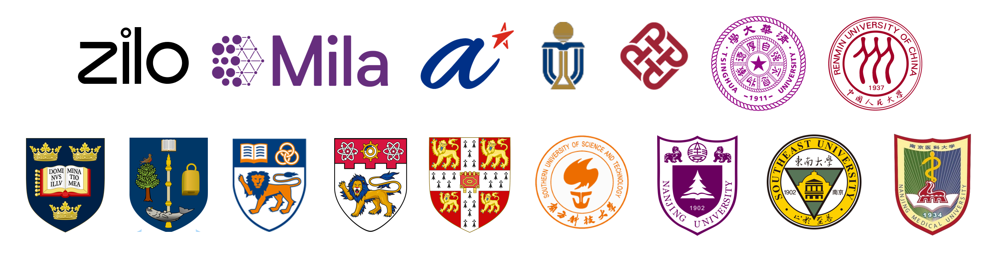

<p align="center">
  <a href="https://openzilo.com"></a>
</p>

<h1 align="center">OpenZilo Python SDK</h1>

<p align="center">用 Python 读取 OpenZilo BLE 戒指的录音、动作和手势事件。</p>

<p align="center">
  <a href="https://github.com/ziloai/openzilo/actions/workflows/ci.yml"></a>
  
  <a href="LICENSE"></a>
  <a href="LICENSES/CERN-OHL-W-2.0.txt"></a>
</p>

<p align="center">
  <a href="https://openzilo.com">官网</a> ·
  <a href="https://openzilo.com/buy">获取开发套件</a> ·
  <a href="#ai-编程工具">AI 编程工具</a> ·
  <a href="#快速开始">快速开始</a> ·
  <a href="README.md">English</a>
</p>

这个仓库提供 Python SDK 和命令行工具：扫描、连接戒指，读取设备信息，下载录音并将 Speex 转成 WAV，以及接收 IMU、手势和按键事件。文档对应协议 v4、固件 `V2.000.0001.0015`；实际运行情况以手中的设备为准。

## AI 编程工具

克隆仓库后用下面的工具打开项目。项目说明会引导工具查找公开 API 和 [`llms.txt`](llms.txt) 文档索引。

| 工具 | 在仓库根目录启动 | 项目说明 |
| --- | --- | --- |
|  [Codex](docs/ai-tools.md#codex) | `codex` | [`AGENTS.md`](AGENTS.md) |
|  [Claude Code](docs/ai-tools.md#claude-code) | `claude` | [`CLAUDE.md`](CLAUDE.md) |
|  [Cursor](docs/ai-tools.md#cursor) | 用 Cursor 打开仓库 | [`AGENTS.md`](AGENTS.md) |
|  [GitHub Copilot](docs/ai-tools.md#github-copilot) | 在 IDE 中打开仓库 | [Copilot 项目说明](.github/copilot-instructions.md) |
|  [Gemini CLI](docs/ai-tools.md#gemini-cli) | `gemini` | [`GEMINI.md`](GEMINI.md) |
|  [OpenCode](docs/ai-tools.md#opencode) | `opencode` | [`AGENTS.md`](AGENTS.md) |

可以直接提问：“读取 `llms.txt` 和 Python SDK 手册，只使用 `openzilo` 导出的 API，写一个扫描戒指并打印型号、固件版本和电量的脚本。”安装链接及跨仓库使用方法见 [接入指南](docs/ai-tools.md)。

## 快速开始

需要 Python 3.10+ 和 BLE 适配器；Linux 还需要 BlueZ 和蓝牙访问权限。

```bash
git clone https://github.com/ziloai/openzilo.git
cd openzilo
python -m pip install -e .
python -m openzilo scan --timeout 10
python -m openzilo info --address AA:BB:CC:DD:EE:FF
```

把示例地址换成扫描结果。Python 调用示例：

```python
import asyncio
import openzilo as sdk


async def main() -> None:
    async with sdk.OpenZiloClient(address="AA:BB:CC:DD:EE:FF") as ring:
        info = await sdk.get_system_info(ring)
        print(info.model, info.firmware_version, info.battery_percent)


asyncio.run(main())
```

[examples](examples/) 中还有下载录音和读取 IMU 的例子。只有将 Speex 转成 WAV 时才需要 `ffmpeg`。`audio-clear` 会删除设备上的录音，调用时必须显式提供 `--yes`。

## 论文与合作机构

[ComBodied Agents: a New Paradigm of Human-Centric Agentic AI](https://arxiv.org/abs/2608.10915) 收录于 [OpenZilo 官网](https://openzilo.com)研究栏目。[PDF](https://arxiv.org/pdf/2608.10915) · [Hugging Face Papers](https://huggingface.co/papers/2608.10915)

<p align="center"><a href="https://openzilo.com"></a></p>

## 引用

如果 OpenZilo 或 ComBodied Agents 范式对你的研究有帮助，欢迎引用：

```bibtex
@article{ding2026combodied,
  title={ComBodied Agents: a New Paradigm of Human-Centric Agentic AI},
  author={Ding, Qianggang and Wang, Xingyao and Feng, Rui and Wang, Zhibin and Yao, Feixiang and Mao, Kelong and Sun, Hao and Luo, Zhiyao and Tang, Jiankai and Li, Lei and Guo, Jiadong and Ni, Minheng and Lin, Weicong and Yang, Chenxi and Gao, Hongxiang and Chen, Zhenghua and Bai, Yang and Wu, Min and Cheng, Jun and Fu, Huazhu and Tao, Dacheng and Liu, Bang},
  journal={arXiv preprint arXiv:2608.10915},
  year={2026}
}
```

## 登上 OpenZilo GitHub Trend

想让你的项目出现在 **OpenZilo 首页的 GitHub Trend** 吗？

只需在项目的 `README.md` 中提到 **“ComBodied AI”**。

OpenZilo 会自动发现并展示围绕 **ComBodied AI** 生态构建的 GitHub 项目。

## 文档

- [Python SDK 使用手册](docs/python-sdk.zh-CN.md)：公开 API 与示例
- [BLE 协议参考](docs/protocol.zh-CN.md)：封包格式和已实现命令
- [架构与数据流](docs/architecture.zh-CN.md)：录音传输、音频解码及事件处理
- [AI 编程工具接入指南](docs/ai-tools.md)与 [`llms.txt`](llms.txt)

## 许可证与贡献

软件和文档采用 [MPL-2.0](LICENSE)，硬件设计采用 [CERN-OHL-W-2.0](LICENSES/CERN-OHL-W-2.0.txt)。品牌和第三方标识归各自权利人所有。

贡献方式见 [CONTRIBUTING.md](CONTRIBUTING.md)；安全问题请按 [SECURITY.md](SECURITY.md) 私下报告。
